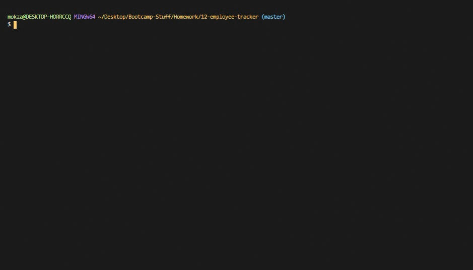

# Employee Tracker
## Description

An application that makes non-developers' lifes easier! Users are able to view and interact with information stored in the databases.

[](https://opensource.org/licenses/MIT)


## Installation

Make sure that Node.js is installed, then run this in the terminal
```
npm install
```

## Usage

1. Run 'node server.js' or 'npn start' in terminal
2. There will be a list of options to get started:
   - View All Employees: generates a console.table for all the data
   - View Departments: generates a console.table for the registered departments
   - View Roles: generates a console.table for all listed roles
   - Add Employee: adds a new employee to the database
   - Add Department: adds a new department to the database
   - Add Role: adds a new role/position
   - Update Role: allows users to make any changes for employees' roles
3. Select "Exit" to end the application


## License

License for this project: MIT

## Contributing

1. Fork/Clone this repo
2. Hack away!
3. Create a new pull request
4. Good commits will be accepted

## Testing




## Questions

If you have any questions/doubts, feel free to contact me via:
* GitHub: [https://github.com/ZanHong](https://github.com/ZanHong)
* Email: [mokzanhong92@hotmail.com](mailto:mokzanhong92@hotmail.com)
